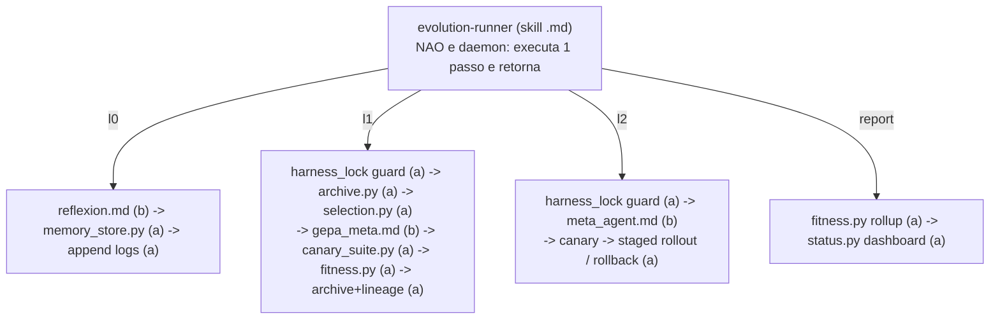
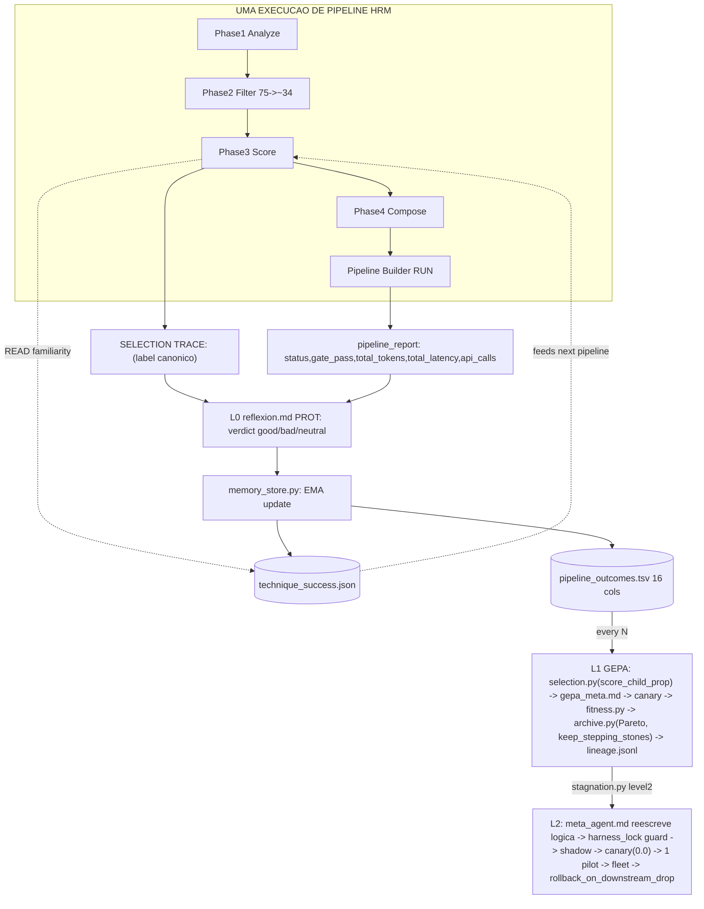
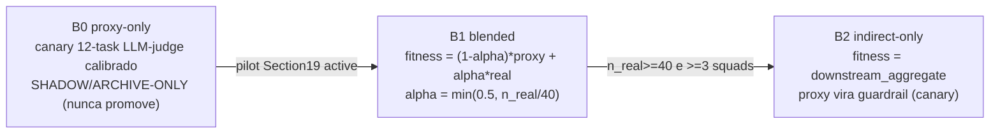
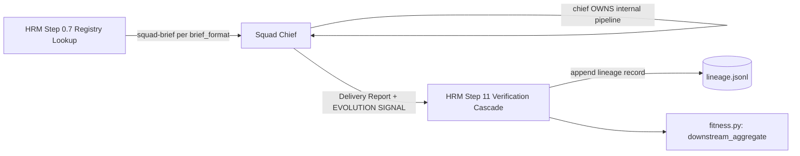
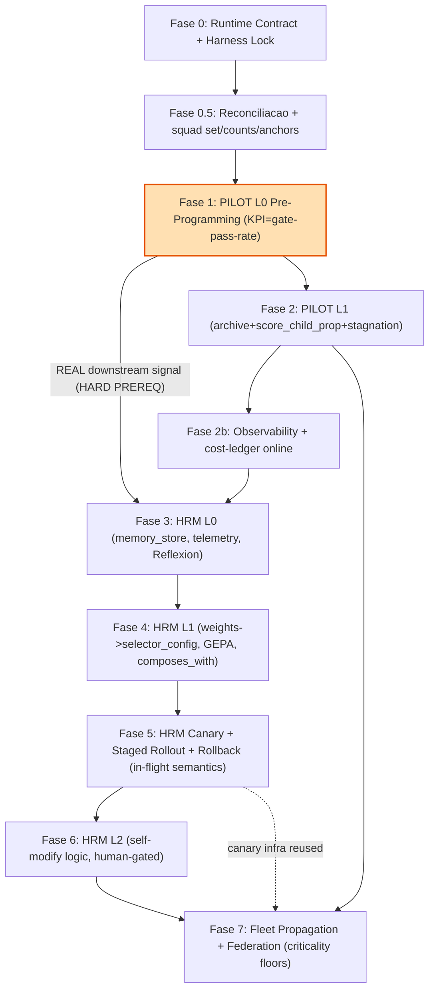

# ULTRAPLAN — Camada de Evolucao (Section 19) do Squad HRM e da Frota

> **Documento autoritativo.** Versao 1.0 — 2026-06-02
> **Base path (verificado em disco):** `C:/Users/migue/Desktop/Obisidian/SQUADS/Squad HRM/`
> **Idioma:** PT-BR. Identificadores tecnicos, paths, chaves de config e nomes de metodo permanecem em ingles (`downstream_aggregate_score`, `score_child_prop`, `quality_gates`, `harness_lock.py`, etc.).
> **Atencao Windows:** o diretorio esta grafado `Obisidian` (nao "Obsidian") e `Squad HRM` contem espaco. Use sempre paths absolutos entre aspas. `glob` e instavel nesta arvore — use `Bash`/`Read` com path absoluto.

Este plano transforma o repositorio `Squad HRM` (markdown + YAML conduzido por agentes Claude Code) em um sistema **auto-melhorante** via uma "Section 19" padronizada (a Camada de Evolucao), e define como o HRM — o meta-orquestrador — orquestra as 15 squads-folha (atuais e futuras) e como a mesma Section 19 e propagada para cada uma. O usuario executara o plano. **Toda afirmacao aqui esta ancorada na recon verificada em disco; onde os docs de metodologia conflitavam com a recon, a recon prevalece.**

---

## 1. Resumo Executivo + a Tese do "Lever Recursivo"

### 1.1 O que estamos construindo

Uma **Camada de Evolucao** (Section 19) com tres lacos de auto-melhoria:

- **L0 (por tarefa):** o sistema aprende com o uso — cada pipeline produz um sinal de fitness que retroalimenta o seletor de tecnicas e o KPI da squad.
- **L1 (a cada N tarefas):** gera variantes (pesos, grafo de composicao, playbooks), arquiva-as com linhagem e seleciona o proximo "parent" de qualquer stepping stone via `score_child_prop`.
- **L2 (em estagnacao):** um meta-agente reescreve a propria logica de selecao / config / prompts (auto-modificacao estilo DGM), validada por fitness downstream e canary de regressao zero.

### 1.2 A tese do lever recursivo — por que o HRM PRIMEIRO

O HRM **nao e uma squad-folha**. Ele e o **meta-orquestrador**: para qualquer tarefa, ele SELECIONA tecnicas de prompt-engineering e as ENCADEIA num pipeline que **todas as demais squads herdam** (recon: `execution/squad-delegation.md` L126 — "HRM does NOT manage the squad's internal process"; mas o pipeline/metodologia e herdado via o seletor). Logo:

> **Melhorar o HRM melhora a metodologia que a frota inteira herda.** Esse e o lever recursivo do DGM — o ponto de maxima alavancagem. Uma melhoria de 1pp no seletor do HRM se propaga por 15 squads; uma melhoria de 1pp numa squad-folha fica naquele dominio.

Por isso o **fitness do HRM e INDIRETO**: `downstream_aggregate_score` = agregado dos ganhos de KPI das squads downstream causados pelos pipelines do HRM. Isso **acopla** a Section 19 do HRM a Section 19 das folhas — o MMOS inteiro se auto-melhora **como um sistema**, nao como pecas isoladas.

### 1.3 A contrapartida critica do lever recursivo: blast radius

Como uma mutacao ruim do HRM se propaga para **toda a frota** (blast radius = fleet), a seguranca do HRM e **estritamente mais rigorosa** que a de qualquer folha: canary cross-squad com `regression_ceiling = 0.0`, staged rollout `shadow -> 1 pilot -> fleet`, rollback automatico, e um kernel imutavel hash-locked. **O HRM e o ULTIMO a ser ligado**, depois que pelo menos uma folha (Cybersecurity ou Data) ja emite sinal real de fitness.

### 1.4 As 6 correcoes estruturais da revisao adversarial (incorporadas)

A revisao adversarial demonstrou que o design ingenuo **pode ser gamed** e que o "kernel imutavel" **nao e auto-protetor** quando o agente pode editar qualquer arquivo. Este plano incorpora as correcoes:

| # | Falha estrutural | Correcao adotada |
|---|---|---|
| C1 | "Imutavel" via hash que o proprio agente pode reescrever (circular) | **Root of trust FORA do alcance do agente**: verificador roda de `.git/hooks/` (pre-commit/pre-push) a partir de um SHA fixado fora da working tree; promocao so e valida se um verificador EXTERNO (hook/humano/cron) gravou o "guard PASSED". |
| C2 | `weights_by_squad` dentro de kernel "reselavel" -> HRM redefine sucesso | Aprovacao humana **nao-forjavel**: reseal exige **git tag assinado** (`git tag -s`) com chave que o agente nao possui, OU token rotativo out-of-band (PushNotification). `weights_by_squad` so muda por essa via. Identidade git do agente separada da humana; hook rejeita commit de kernel com autor == agente. |
| C3 | Fitness gamed por steer-to-easy-squad + canary fixo overfitavel | **Fitness distribution-aware**: piso de cobertura por squad, agregacao `min`/CVaR (nao mean pura), canary **held-out rotativo** de um pool maior hash-locked, detector de routing-skew (KL) como gate. |
| C4 | `mean(gate_pass * kpi_delta)` zero-inflado, judge-bias, sem CI | **Decompor** em (a) `gate_pass_rate` e (b) `E[kpi_delta | pass]`, com **intervalo de confianca bootstrap** e gate em AMBOS; juiz LLM com `judge_model_id + prompt_hash + temperature` no kernel.seal; ancorar >=1 oraculo nao-LLM por computacao. |
| C5 | Rollback git assume 1 working tree (squads sao repos separados) | **Rollback por-repo honesto**: `git revert` do HRM so restaura arquivos do HRM; cada folha reverte o proprio repo; ledger de linhagem unico no repo do HRM; reads cross-repo tratados como input **untrusted** (hash-checado na ingestao). |
| C6 | never_stop e cron irreais; L0 voluntario sem hook | **never_stop honesto** = L0 por **Stop hook** real + estado duravel + cadenciador re-armado; cron durável expira em 7 dias (avisado); DSPy nao roda in-session (deferido `requires_runner:true`); GEPA e o engine default. |

### 1.5 Estado-alvo (Definition of Done resumida)

Ao final: o piloto-folha (Pre-Programming) se auto-melhora end-to-end; o HRM aprende com uso (familiaridade muda ranking comprovadamente); o HRM evolui seus pesos/composes_with/playbooks via GEPA; canary bloqueia variantes ruins com regressao zero; o lever recursivo (L2) e seguro e nao pode tocar o kernel; a Section 19 e drop-in para qualquer squad; a federacao realoca orcamento por `progress_velocity` com pisos de criticidade. (DoD completa na Secao 10.)

---

## 2. Baseline VERIFICADO do Repo — Realidade vs. Suposicoes dos Docs

Esta secao corrige **explicitamente** cada claim "refuted"/"partial" da recon. **Sempre que um doc de metodologia afirmou algo, a recon em disco prevalece.**

### 2.1 Tabela de reconciliacao (claim -> status verificado -> acao)

| # | Claim do doc de metodologia | Status (recon em disco) | Realidade / acao |
|---|---|---|---|
| B1 | Pesos do seletor 0.35/0.25/0.20/0.15/0.05 | **CONFIRMED** | `technique-selector.md` L195-197 e os 5 cabecalhos L157/166/177/185/190. Nomes e pesos batem **verbatim**. Plano usa-os literalmente. |
| B2 | `memory.success_rate` / familiarity e persistido | **REFUTED (stub)** | Unicas referencias: L191 (comentario) e L192 `familiarity = memory.success_rate(technique.id) * 100`. **Nenhuma** definicao/schema/write-path/persistencia. E um STUB invocado, nunca populado. Peso 0.05 = tie-breaker. **Acao: CONSTRUIR `memory_store.py` + `technique_success.json` (Fase 3). Nao apresentar como capacidade existente.** |
| B3 | `composes_with` graph existe em taxonomy.yaml com tags de provenance | **REFUTED** | `grep -c composes_with taxonomy.yaml` = **0**. Entradas tem so: id/name/aliases/file/template/complexity/token_cost/num_calls/best_for/avoid_when. **Acao: AUTORAR um bloco aditivo top-level `composes_with:` do zero, cada edge com `source: paper|heuristic|empirical`. Sequenciar a autoria ANTES de qualquer `meta.targets` referenciar `taxonomy.yaml#composes_with`.** |
| B4 | Telemetria `metrics: {tokens, latency, calls}` | **PARTIAL (3 nomes)** | Diagrama (L44) usa `{tokens,latency,calls}`; loop operacional (L213-216) usa `{total_tokens,total_latency,api_calls}`; report (L345-356) usa `total_latency_seconds`. **Acao: canonico = `{total_tokens, total_latency, api_calls}`; corrigir os 3 sites num unico commit.** |
| B5 | "Decision Trace" = "SELECTION TRACE" | **PARTIAL (mismatch)** | Heading `## Decision Trace` (L280); label literal `SELECTION TRACE:` (L285). **Acao: token canonico de grep = `SELECTION TRACE:`; renomear o heading (obrigatorio, nao "recomendado").** |
| B6 | Existe `quality_gates:` top-level no config | **PARTIAL** | NAO ha top-level `quality_gates:`. Ha `paths.quality_gates` (string, L17), `architecture.quality_gate_levels` (lista [syntax,local,global,semantic], L73-77) e `domain_thresholds` (numeros, L79-87). **Acao: REFERENCIAR esses anchors, nunca redefinir.** |
| B7 | `data/` existe | **REFUTED** | Confirmado: sem `data/` em Squad HRM. Squads-irmas usam `data/metrics/` + `data/registries/`. **Acao: criar `data/`; adicionar `paths.data: "data/"`.** |
| B8 | config.yaml termina em L114 / 9 top-level keys | **REFUTED** | EOF = **L113** (verificado `wc -l`); **8** top-level keys: version, last_updated, squad, paths, counts, architecture, domain_thresholds, prompt_forge. **Acao: anexar `evolution:` no EOF real (apos `prompt_forge`), localizado por anchor, nunca por numero de linha.** |
| B9 | 6 playbooks estaticos | **REFUTED (7)** | `ls playbooks/` = **7**: agent-orchestration, code-generation, creative-writing, data-extraction, design-system-analysis, rag-pipeline, research-and-analysis. **Acao: tratar 7 como verdade.** |
| B10 | Gates sao executaveis | **REFUTED** | `gate-runner.md` e PROTOCOLO markdown; o agente roda Bash/Read/Grep e aplica rubricas a mao. `status=PASSED` e um veredito LLM. **Acao: fitness via opcao (a) — gate-runner persiste `verification_result` em `data/metrics/`; um `fitness.py` deterministico agrega; NUNCA afirmar que gates sao "chamados".** |
| B11 | `weights_by_squad` existe no repo | **REFUTED** | `grep weights_by_squad` = **0 hits**. E **inventado** pela camada de evolucao. **Acao: nao colocar dentro de kernel reselavel pelo otimizador; mudanca so via token out-of-band (C2).** |
| B12 | Registry: artifact/lineage entry type existe | **REFUTED** | `_schema.yaml` tem 6 tipos (skill/agent/squad/mcp/playbook/framework), nenhum de artefato/linhagem. `squad_entry` e raso (quality_integration tipado `string`, mas dado e objeto). **Acao: linhagem e GREENFIELD — novo `artifact_entry` + `registry/artifacts.yaml`; nao sobrecarregar `squad_entry`.** |
| B13 | registry total de squads | **CONFIRMED 12, mas disco tem 15 folhas** | `squads.yaml` `total: 12`. Em disco ha 16 dirs (15 folhas + Squad HRM). **Acao: reconciliar para 15 (Secao 9).** |
| B14 | "Gold Standard / 18-section" template compartilhado | **REFUTED** | Nao existe template unico de 18 secoes. "18" em Pre-Programming = 18 AGENTES. So Data e Deep-Research tem `docs/gold-standard-and-sota.md`. **Acao: definir Section 19 explicitamente; nao referenciar um template inexistente.** |
| B15 | Cada squad e o mesmo working tree | **REFUTED** | Cada squad e **repo git separado** (`.git` proprio confirmado em Cybersecurity/Data/Pre-Programming/Sales). gpgsign UNSET, 1 identidade ("Miguel Saviotti"). **Acao: tooling cross-repo usa paths absolutos + git por-repo; rollback so do repo promovido (C5).** |
| B16 | Squad de Copy e Sales | — | "Squad de Copy - Em Desenvolvimento" e "Sales-Call-Intelligence-Squad" **existem em disco**. Sales tem `data/metrics/` (close-rate-by-closer.yaml etc.). **Acao: incluir Sales como squad real; DELETAR placeholder "future Sales" (Secao 9).** |
| B17 | Python disponivel | **CONFIRMED** | Python **3.12.10** local. Scripts Tier-(a) sao executaveis via Bash. **Acao: manter scripts stdlib-only.** |

### 2.2 Pilotos: realidade de instrumentacao (recon)

- **Pre-Programming-Squad** = mais completo (GOLD/SOTA auto-declarado, ~694 arquivos, `data/metrics/*.yaml` por-metrica com formula+target+frequency+owner, `kpi-tracking-registry.yaml`, `kpi_collection_on_completion: true`). **PILOTO #1.**
- **Deep-Research-Squad** = KPIs mais machine-readable (cada kpi com target+measurement). **Runner-up.**
- **Sales-Call-Intelligence-Squad** = tem `data/metrics/` real (KPI auto: close_rate / extraction_accuracy). **Squad real, nao placeholder.**
- **Squad Hormozi** = **stub: SEM `data/`** em disco. KPIs sao listas nuas, sem score_thresholds. **NAO pilotar; track de remediacao separado, por ultimo.**
- 11/12 squads no registry sao `status: mapped` (stubs). **Verificar realidade (status + `data/` em disco) antes de depender.**

---

## 3. Decisao de SUBSTRATO / Runtime — Como os 3 Lacos REALMENTE Executam

### 3.1 A realidade dura

O repo e **markdown + YAML conduzido por um agente Claude Code session-based**. **Nao ha daemon, scheduler, nem service loop.** Gates sao protocolos agente-run, nao executaveis (B10). Nao existe per-task hook configurado hoje (so SessionStart). Portanto:

> **Os lacos nao "rodam" — eles sao RE-ENTRADOS por gatilhos.** Cada laco e uma unidade de trabalho que o agente executa quando disparado, lendo/escrevendo arquivos de estado duravel para que o progresso sobreviva entre sessoes.

### 3.2 Classificacao em 3 tiers (a classificacao load-bearing)

Todo mecanismo da Camada de Evolucao e exatamente **um** de tres tipos:

| Tier | O que e | O que roda nele | Por que |
|---|---|---|---|
| **(a) DET** — utilitario deterministico | `.py` stdlib-only sob `evolution/`, invocado via Bash | hashing, archive versioning, `score_child_prop` sampling, stagnation stats, log/lineage appends, memory_store I/O, **agregacao** de fitness, canary scoring arithmetic, rollback (`git revert`), budget guard | math/hash/IO precisa ser byte-reproduzivel e tamper-evident; o agente nao pode forjar um SHA256 |
| **(b) PROT** — protocolo markdown LLM-agente | `.md` que o agente SEGUE (mesmo modelo de `gate-runner.md`) | Reflexion (critica verbal), reflexao GEPA, reescrita L2 (DGM), scoring LLM-judge de KPIs fuzzy, geracao de variante | sao julgamentos; o modelo E o operador de mutacao |
| **(c) DATA** — arquivos de estado | TSV/JSONL/JSON/YAML sob `data/metrics/` e `data/registries/evolution/` | attempt log, lineage, technique_success, pipeline_outcomes, archive de variantes | sessoes sao stateless; o filesystem e a unica memoria persistente |

**Split critico do fitness (recon-driven):** *pontuar um output* contra uma rubrica e Tier (b) (LLM-judge, pois gates sao agente-run). *Agregar os scores num numero* e Tier (a) (`fitness.py`, aritmetica pura). E a unica forma de honrar "fitness deve ser auto-mensuravel" sem inventar um engine de gate executavel.

### 3.3 O `evolution-runner` (ponto de entrada nao-daemon)



Invocacao literal (exemplo):
```
python "C:/Users/migue/Desktop/Obisidian/SQUADS/Squad HRM/evolution/selection.py" \
  --archive "data/registries/evolution/selector" --novelty-weight 0.30 --seed 1337 --emit parent
```

### 3.4 Modelo de gatilhos — o "never_stop" honesto (C6)

| Laco | Gatilho canonico | Como dispara de verdade | Fallback |
|---|---|---|---|
| **L0** (por tarefa) | **event-driven inline** | Hook no ponto universal **Step 11 verification cascade** (`gate-runner.md`): apos emitir `verification_result`, roda `evolution-runner l0`. Todo execution_mode passa por aqui -> cobertura garantida. **Adicionalmente: instalar um Stop hook real** em `.claude/settings.json` rodando `evolution/l0_close.py` (sem ele, L0 e voluntario — falha critica da revisao). | item de checklist `verification-before-completion` |
| **L1** (a cada N) | **cadence-driven** | contador em `evolution_log.tsv` cruza N -> `stagnation.py` retorna `fire_l1` -> runner encadeia L1 na mesma sessao; OU `/loop` manual | **cron durável** (`CronCreate durable:true`) — **mas expira em 7 dias** (avisar) e so dispara com REPL idle |
| **L2** (em estagnacao) | **on_stagnation** | `stagnation.py` retorna `fire_l2` (L1 saturado em `level2_patience`); runner invoca `meta_agent.md`, gated por canary + staged rollout + zero-regressao + **confirmacao humana** | manual `evolution-runner l2`; **nunca timer cego** |

> **`never_stop` resolvido honestamente:** NAO e processo infinito (impossivel aqui). Significa: (1) **L0 dispara em toda tarefa** (event-driven, gratis, inline) via Stop hook; (2) **estado durável** em `data/` -> toda sessao resume; (3) **cadenciador re-armado** (Stop hook / `/loop` / cron durável com aviso de expiracao de 7 dias) para L1/L2. O config encoda `never_stop.semantics: "event_driven_L0 + cadence_driven_L1_L2"` e `resume_from: data/...`.

### 3.5 GEPA/DSPy sao "rodaveis" aqui?

- **GEPA = SIM**, como laco PROT: evolucao reflexiva de prompt em NL sobre traces gravados + frontier de Pareto. Um "rollout" = **uma passada de pipeline real que o agente executa** contra a canary battery, gravada em `pipeline_outcomes.tsv`. **Engine default.** GEPA e ~35x mais sample-efficient que PromptBreeder (que precisa de 5k-25k chamadas — inviavel em cadencia de sessao).
- **DSPy = NAO** nativamente: precisa de um otimizador Python + muitos rollouts via endpoint de modelo in-process, ausente neste runtime. **Deferido atras de `requires_runner: true`.** Nunca afirmar que DSPy roda in-session.

### 3.6 Viabilidade dos scripts Tier-(a)

Python 3.12.10 confirmado (B17). Scripts sao **stdlib-only** (sem deps), puros (stdin/file in -> file/stdout out), **sem service loop**, < ~150 LOC cada, invocados sob demanda. Risco: se o ambiente bloquear execucao de script, o lock/sampling degradam para hand-computation (forjavel) — mitigacao: verificar runtime na Fase 0, fail-closed.

---

## 4. Schema Canonico da SECTION 19 (Reconciliado ao config.yaml real) + Contrato da Pasta `evolution/`

### 4.1 Bloco `evolution:` canonico — variante HRM (orchestrator)

Anexar **no EOF real** de `config.yaml` (apos `prompt_forge`, localizado por anchor — **nao** por L114, que esta errado: EOF e L113). Bump `version: "2.0" -> "2.1"` + `last_updated`. Estilo da casa: indent 2-espacos, version/strings entre aspas duplas, block maps.

```yaml
# ---------------------------------------------------------------------------
# Section 19 — Evolution Layer  (added v2.1)  # EVOLUTION-ANCHOR: section-19
# Tres lacos (L0/L1/L2). REUSA anchors existentes e NAO os redefine:
#   - fitness floors  -> domain_thresholds (L79-87)
#   - gate cascade    -> architecture.quality_gate_levels (L73-77)
#   - attempt log     -> data/metrics/  (paths.data abaixo)
# Runtime: lacos sao RE-ENTRADOS por gatilhos, nao um daemon. Ver evolution/README.md.
# ---------------------------------------------------------------------------
evolution:
  enabled: true
  role: "orchestrator"            # squads-folha usam "leaf"
  mode: "hybrid"                  # open_ended | hill_climb | hybrid
  l1_l2_armed: false              # GATE GLOBAL: so true quando >=1 folha emite n>=min_samples downstream rows
  shadow_only_until_pilot: true   # B0 proxy NUNCA promove default ate B1 (pilot real)

  kernel:                         # IMUTAVEL, hash-verificado (anti-reward-hacking)
    fitness_metric: "downstream_aggregate_score"
    fitness_direction: "maximize"
    # C4: NAO um escalar multiplicado; decomposto em pass_rate + KPI condicional
    fitness_formula: "decomposed(gate_pass_rate, mean(kpi_delta_norm | gate_pass=1))"
    aggregation: "min_or_cvar_over_squads"   # C3: nao mean pura (steer-to-easy bloqueado)
    metric_hash: "sha256:PENDING"            # set por harness_lock.py freeze; nunca hand-edit
    meta_metric: "downstream_aggregate_score"
    meta_metric_hash: "sha256:PENDING"
    quality_gates_locked: true
    quality_gate_levels_ref: "architecture.quality_gate_levels"   # NAO redefinido
    domain_thresholds_ref: "gate-definitions.yaml#domain_thresholds"  # fonte da verdade
    # C4: instrumento de medicao sob auditoria (juiz LLM nao pode ser hasheado, mas e pinado)
    judge_lock: { judge_model_id: "PENDING", prompt_hash: "PENDING", temperature: 0, seed: 1337 }
    budget_per_attempt:           # HRM (orchestrator) — valor RECONCILIADO unico
      max_tokens: 200000
      max_seconds: 900
      max_cost_usd: 5.00
    # C8: floors de seguranca DENTRO do kernel (otimizador nao pode afroxar)
    diversity_floor: 0.40
    level1_patience: 10
    level2_patience: 50
    canonical_telemetry: ["total_tokens", "total_latency", "api_calls"]

  archive:
    location: "data/registries/evolution/"
    track: ["variant_id","parent_id","score","novelty","children","plan_version","created_at"]
    selection:
      method: "score_child_prop"   # P proporcional a sigmoid(score) * 1/(children+1) * novelty
      novelty_weight: 0.30
      keep_stepping_stones: true   # nunca descarta ancestrais
      seed_policy: "logged"
    update_policy: "keep_all"

  meta:
    engine: "gepa"                 # gepa (default in-session) | dgm_diagnose | promptbreeder
    targets:                       # HRM mira a PROPRIA logica:
      - "evolution/selector_config.yaml"    # os PESOS (L1)
      - "hrm-agent/technique-selector.md"   # a LOGICA de selecao (L2)
      - "taxonomy.yaml#composes_with"        # AUTORAR antes de referenciar (B3)
      - "playbooks/"                         # 7 playbooks (B9)
    forbidden_targets:             # NUNCA mutaveis pelo otimizador
      - "evolution/kernel/*"
      - "gate-definitions.yaml#domain_thresholds"
      - "checklists/*"
    trigger: "on_stagnation"

  weights_by_squad:                # FORA do kernel reselavel pelo otimizador (C2/B11). Muda so via token out-of-band.
    cybersecurity: 1.5
    data: 1.3
    default: 1.0

  safety:                          # SO HRM (blast radius = frota). OMITIR em folhas.
    canary_required: true
    canary_suite: "evolution/canary/canary_suite.yaml"
    canary_holdout: true           # C3: held-out rotativo de pool maior hash-locked
    regression_ceiling: 0.0        # ZERO regressao no canary para promover
    routing_skew_gate: true        # C3: bloqueia se KL(routing_variant || incumbent) > limiar
    staged_rollout: ["shadow", "one_pilot_squad", "fleet"]
    pilot_squad: "cybersecurity"   # ou data; Section 19 ACTIVE primeiro (PREREQ)
    rollback_on_downstream_drop: true
    drop_threshold: 0.03
    rollback_window: 10
    human_approval_required_for: ["kernel_reseal", "weights_by_squad_change", "pilot_to_fleet", "first_n_l2_promotions"]

  operation:
    never_stop:
      semantics: "event_driven_L0 + cadence_driven_L1_L2"   # NAO infinito
      l0_trigger: "per_task"       # Step-11 cascade + Stop hook
      l1_trigger: "cadence"
      l2_trigger: "on_stagnation"
      resume_from: "data/registries/evolution/ + data/metrics/"
    hard_stop_on_budget: true
    log: "data/metrics/evolution_log.tsv"
    audit: "data/registries/evolution/lineage.jsonl"
```

**Edits menores acoplados ao mesmo commit:** adicionar a `paths:` -> `data: "data/"` e `evolution: "evolution/"`. Criar `data/metrics/` e `data/registries/evolution/` com `.gitkeep` (convencao das irmas).

### 4.2 Variante FOLHA (delta drop-in)

O MESMO bloco com tres mudancas: (1) `role: "leaf"` e **deletar `safety:` + `weights_by_squad`**; (2) `kernel.fitness_metric` = o UM KPI auto-mensuravel da squad (seu `val_bpb`, ver Secao 9); (3) `meta.targets` = prompts/agents/playbooks da propria squad. Caps de budget folha menores (`max_tokens: 12000, max_seconds: 90, max_cost_usd: 0.20`).

### 4.3 Contrato da pasta `evolution/` (por arquivo: kind/purpose/inputs/outputs)

Root: `SQUADS/Squad HRM/evolution/` (folhas: `<squad>/evolution/`).

| Arquivo | Kind | Purpose | Inputs | Outputs |
|---|---|---|---|---|
| `README.md` | .md doc | Contrato do substrato (DET/PROT/DATA) + tabela de gatilhos | — | — |
| `kernel/fitness.yaml` | yaml (FROZEN) | fitness_metric + formula decomposta + metric_hash | — | hash |
| `kernel/gates.lock.yaml` | yaml (FROZEN) | pin do hash de `gate-definitions.yaml#domain_thresholds` + floor_invariants (cyber 0.95) | — | gates_hash |
| `kernel/meta.yaml` | yaml (FROZEN) | meta_metric + meta_metric_hash + forbidden_targets + judge_lock | — | meta_hash |
| `kernel/kernel.seal.json` | json | combined_hash + approved_by/ts + git_commit (so via reseal humano) | — | seal |
| `harness_lock.py` | .py DET | `verify | guard | reseal --approve | status`; serializacao canonica + SHA-256; reverte em tamper | kernel files | exit 0/3/2/4 |
| `selection.py` | .py DET | `score_child_prop` com novelty + seed logado | archive, novelty_weight, seed | parent_id + trace |
| `archive.py` | .py DET | grava variante + bump children + lineage edge; Pareto front | variant json, parent_id | variant file + lineage append |
| `stagnation.py` | .py DET | patience L1/L2 + diversity floor sobre attempt log | evolution_log.tsv, cfg | verdict continue/fire_l1/fire_l2 |
| `memory_store.py` | .py DET | persiste technique success rates (acende o stub B2) | technique_success.json, outcome | json atualizado por technique.id |
| `fitness.py` | .py DET | agrega scores -> numero (HRM: downstream_aggregate; folha: KPI rollup); **CI bootstrap, gate em pass_rate E KPI condicional**; aborta se metric_hash != kernel | pipeline_outcomes.tsv, weights_by_squad | fitness_record (com CI) |
| `selector_config.yaml` | yaml | os PESOS evolvable (extraidos de L195-197) | — | 0.35/0.25/0.20/0.15/0.05 + historico |
| `canary_suite.py` | .py DET | roda bateria held-out vs baseline; `regression_ceiling=0.0` hard; roda `harness_lock guard` primeiro | candidate config | promotable + per-archetype delta |
| `lineage_audit.py` | .py DET | detectores H1..H7 (anti-reward-hack, incl. H2 CHECK_DELETION) | lineage.jsonl + git diff | EXIT 6 bloqueia |
| `rollback.py` | .py DET | `git revert` (so repo do HRM) + quarantine; nunca deleta | promotion_commit, trigger | last-known-good restaurado |
| `budget_guard.py` | .py DET | caps per-attempt; self-test de fields canonicos (fail-closed) | telemetry | abort em breach |
| `federation.py` | .py DET | progress_velocity (slope shrinkage) + softmax c/ floor de criticidade | each squad evolution_log.tsv | federation_ledger.yaml |
| `status.py` | .py DET | dashboard de saude (slope, last-run, loops, stage, cron-age) | logs | dashboard.md |
| `sync_check.py` | .py DET | re-deriva squad set/counts/anchors de disco; FALHA em drift | disco + registry | exit 0/1 |
| `reflexion.md` | .md PROT | L0 critica verbal pos-task -> outcome record | trace, gate result | nota + record p/ memory_store |
| `judge.md` | .md PROT | LLM-judge proxy KPI calibrado (kappa>=0.6) | output + rubrica + labels | score 0..1 |
| `gepa_meta.md` | .md PROT | L1 evolucao reflexiva de pesos/composes_with/playbooks; Pareto | archive, fitness, traces | variante proposta -> archive.py |
| `meta_agent.md` / `algo_evolve.md` | .md PROT | L2 reescrita DGM da logica de selecao | saturation, lineage, traces | target reescrito -> canary -> staged |
| `canary/canary_suite.yaml` + `battery/<archetype>.yaml` + `baseline.json` | yaml/json DATA | bateria fixa (1 task/archetype) + golden + baselines | — | — |

---

## 5. Os TRES LACOS do HRM (L0 / L1 / L2) com Schemas e Dataflow

### 5.1 Visao geral (o staircase tune-weights -> tune-novelty -> rewrite-logic)



### 5.2 L0 — acender o stub de familiaridade

**O hook (verificado):** `technique-selector.md` L192 `familiarity = memory.success_rate(technique.id) * 100`; L195-197 a soma ponderada. `memory` e STUB (B2). L0 faz `memory.success_rate(technique.id)` resolver para um valor real lido de disco e escreve-o apos cada pipeline.

**`data/metrics/technique_success.json` (schema):**
```json
{
  "_schema_version": "1.0",
  "_metric_hash": "sha256:...",
  "techniques": {
    "chain-of-thought": {"success_rate": 0.83, "uses": 41, "wins": 34, "ema_alpha": 0.2, "last_used": "..."}
  }
}
```
**Read (Phase 3):** `memory.success_rate(id)` = `techniques[id].success_rate` (default 0.0 se ausente). **Update (DET, EMA):** `rate_new = (1-alpha)*rate_old + alpha*verdict_binary` (good=1, bad=0, neutral=skip). EMA (nao win/uses) para que o sinal ADAPTE.

**`data/metrics/pipeline_outcomes.tsv` (16 cols, telemetria canonica `{total_tokens,total_latency,api_calls}`):**
```
pipeline_id	timestamp	task_type	complexity	quality_level	playbook	techniques	selector_config_version	status	gate_pass	gate_score	total_tokens	total_latency	api_calls	downstream_kpi_delta	reflexion_verdicts
```

**Re-ranking concreto:** apos 40 pipelines de reasoning bem-sucedidos, `success_rate(cot)=0.90` -> `familiarity = 90`, contribui `90*0.05 = +4.5`. Um irmao a 0.50 contribui `+2.5`. Swing ~2 pontos = **tie-breaker** ate L1 elevar o peso (esse acoplamento e o ponto: L0 produz o sinal, L1 decide o quanto confiar).

### 5.3 L1 — GEPA sobre `selector_config.yaml`

**Pre-requisito de refactor:** extrair pesos para `evolution/selector_config.yaml` e fazer Phase 3 LER de la (senao L1 evolui um arquivo que nada le — no-op silencioso, falha critica da revisao). `composes_with` da taxonomy fica como BASE imutavel; L1 evolui um **overlay** aditivo, nunca edita as 75 entradas.

```yaml
# evolution/selector_config.yaml  (NEW — a "program.md" do HRM)
version: "v1"
genome:
  weights: {task_fit: 0.35, quality_impact: 0.25, efficiency: 0.20, composability: 0.15, familiarity: 0.05}
  composes_with_overlay:
    - {a: chain-of-thought, b: self-refine, w: 1.0, source: empirical}
  playbook_bindings:   # 7 playbooks reais (B9)
    reasoning: research-and-analysis
    code: code-generation
    creative: creative-writing
    extraction: data-extraction
    agent: agent-orchestration
    rag: rag-pipeline
    design: design-system-analysis
```

**Archive Pareto** (`data/registries/evolution/selector/<genome_id>.yaml`): genome + objectives vector {quality, -cost, -latency, diversity} + fitness_scalar + children + on_pareto_front + metric_hash. Dominancia recalculada a cada insercao; `update_policy: keep_all` (stepping stones selecionaveis mesmo dominados).

**Selecao (`selection.py`):** `P(i) proporcional a sigmoid(fitness_i) * 1/(children_i+1) * (1 + novelty_weight * novelty(i))`, normalizado sobre o archive inteiro. Damping de genomes muito-cruzados e baixa-novelty -> busca segue explorando.

**Uma geracao L1:** selection -> `gepa_meta.md` (mutacao reflexiva NL = 1 rollout) -> `canary_suite.py` (held-out) -> `fitness.py` (CI bootstrap) -> `archive.py` (Pareto) -> promocao **so se** domina o default E regride em NENHUM canary (`regression_ceiling=0.0`).

### 5.4 L2 — HRM reescreve a propria logica (auto-modificacao bounded)

**Superficie MUTAVEL:** filter rules (Phase 2), scoring sub-formulas (Phase 3 bodies), ordering/composition rules (Phase 4), playbooks, e `technique-selector.md` em si (o lever recursivo).

**Kernel IMUTAVEL (hash-locked, rejeitado antes de avaliar):** (1) os 5 nomes de dimensao + `Sigma=1.0`; (2) a formula de fitness + `weights_by_squad` + EMA alpha; (3) o gate cascade (`gate-definitions.yaml` thresholds, 4 niveis); (4) o 4-phase control flow (Analyze->Filter->Score->Compose). **Caso DGM enforced:** uma proposta L2 que "melhora fitness" enfraquecendo um gate falha `harness_lock.py` e nunca chega ao canary; todo diff vai para `lineage.jsonl`.

**Guardrails staged:** proposta -> `harness_lock guard` -> SHADOW (decisoes nao aplicadas) -> canary cross-squad `0.0` -> 1 PILOT squad (watch downstream_kpi_delta) -> FLEET -> `rollback_on_downstream_drop`. **Confirmacao humana** nos primeiros L2 (out-of-band, C2/C9).

**Gatilhos numericos (`stagnation.py`):** `level1_stagnation` se best fitness nao melhora > epsilon(0.005) por `level1_patience=10` geracoes OU novelty < `diversity_floor=0.4`; `level2_stagnation` se level1 persiste por `level2_patience=50`. (Floors no kernel, C8.)

### 5.5 `lineage.jsonl` (backbone de proveniencia, append-only, chained)

Cada linha inclui `prev_line_hash` (C-review: chaining torna rewrite silencioso detectavel de um checkpoint externo).
```jsonl
{"ts":"...","loop":"L0","pipeline_id":"...","event":"verdict","technique":"cot","verdict":"good","rate_old":0.81,"rate_new":0.83,"prev_line_hash":"..."}
{"ts":"...","loop":"L1","genome_id":"g_17","parent_id":"g_09","event":"mutation","change":"familiarity 0.05->0.07","fitness":0.83,"on_front":true,"prev_line_hash":"..."}
{"ts":"...","loop":"L2","event":"logic_rewrite","target":"technique-selector.md#phase3.task_fit","kernel_hash_ok":true,"canary":"pass_all","stage":"shadow","prev_line_hash":"..."}
```

---

## 6. FITNESS Indireto + Medicao + Atribuicao + Bootstrap/Cold-Start

### 6.1 A formula (decomposta — C4)

O HRM nao tem KPI proprio; seu fitness e o **agregado** dos ganhos de KPI das folhas. **Nao** um escalar multiplicado (zero-inflado, gamed por route-around-hard-tasks). **Decomposto e gated em ambos:**

```
Para variante de seletor V, por squad s:
  pass_rate(s,V)      = mean gate_pass(i) sobre obs(s,V)
  cond_kpi(s,V)       = mean kpi_delta_norm(s,i) | gate_pass(i)=1
Promocao exige: pass_rate NAO cai E cond_kpi sobe (ambos com CI bootstrap, lower bound > incumbent).

downstream_aggregate_score(V) = AGREGACAO_min_ou_CVaR_sobre_squads( w_s * pass_rate(s,V) * cond_kpi(s,V) )
  com piso de cobertura: n>=min obs em CADA squad viva (C3, anti steer-to-easy).
```

- `w_s` = `weights_by_squad` (cyber 1.5, data 1.3, default 1.0) — **fora** do kernel reselavel (C2).
- Agregacao `min`/CVaR (nao mean): nao se pode vencer esmagando uma squad facil enquanto regride outras (C3/C-review).
- `kpi_delta_norm` em [-1,1] via robust median/IQR contra baseline rolante K=20, `z_cap=3` — mas ancorado tambem a um **reference fixo** congelado na ativacao (C-review fitness 6a, evita target movel/regressao-a-zero).

### 6.2 Atribuicao — separar Delta_HRM de Delta_leaf (C-review critico)

**Mecanismo:** A/B pareado com `leaf_squad_version` PINADO. Cada obs grava 4-tupla em `lineage.jsonl`: `(task_id, hrm_selector_version, leaf_squad_version, kpi_value)`.

- **Paired A/B (primario):** mesmo `task_id`, mesmo leaf pinado, control=V0 vs treatment=V1. `Delta_HRM = kpi(V1)-kpi(V0)` -> cancela efeitos de leaf e dificuldade.
- **DiD (fallback):** restrito ao mesmo `leaf_squad_version` bucket; **placebo/pre-trend test** antes de diferenciar (C-review: parallel-trends nunca testado).
- **Guard:** `fitness.py` recusa atribuir delta com `leaf_squad_version` divergente (`attribution_skipped: leaf_version_mismatch`).
- **Mutual exclusion (C-review critico):** o leaf-piloto deve estar com `evolution.enabled: false` (ou pinado) durante a janela de acrual A/B — HRM e leaf-piloto **nao** evoluem simultaneamente. Bump de versao do leaf = gatilho de re-validacao do seletor promovido.

### 6.3 Cold-start / bootstrap (3 estagios) — sem bloquear HRM, sem promover lixo



**Correcoes da revisao (criticas):**
- **B0 e SHADOW/ARCHIVE-ONLY** (C-review): proxy compartilha juiz/rubrica com o objetivo real -> **nao** e estimador independente. Promocao a default PROIBIDA em B0 (so explorar/arquivar). O proxy passa pelo MESMO gate kappa>=0.6 que folhas (a isencao era o buraco). Juiz do proxy DIFERENTE do juiz do gate (decorrelacao). `proxy_weight = exp(-n_real/10)` decai rapido, controlado fora do otimizador.
- **Canary held-out != bateria de fitness B0** (separar pools congelados).
- **Oraculo nao-LLM obrigatorio** antes de qualquer mudanca de default.

### 6.4 Auto-mensurabilidade real vs falsa (C-review high)

Tag de tres eixos: `{scoring=auto|judge} x {ground-truth=external|internal-checklist|labeled-set} x {label-freshness-owner}`. Qualquer KPI cujo ground-truth e `internal-checklist` (ex.: Pre-Programming gate-pass-rate, DoD completeness) e **CONFORMANCE, nao OUTCOME** — nao pode ser o unico sinal de fitness; precisa de >=1 KPI external-outcome pareado. KPIs label-dependent (cyber FP-rate, data query-correctness) registram `label_set_version + label_date`; se expira o TTL, rebaixar para `proxy`. Contribuicoes judge-scored carregam o kappa como multiplicador de confianca (`contribution *= min(1, (kappa-0.6)/0.4)`).

### 6.5 Tabela de KPI por squad (val_bpb) + status auto-mensuravel

| # | Squad | KPI primario (val_bpb) | Dir | Mensurabilidade | Eixo ground-truth |
|---|---|---|---|---|---|
| 1 | Cybersecurity | false_positive_rate (vulns) | min | **auto** | labeled-set (TTL) |
| 2 | Data | query_correctness / forecast_accuracy | max | **auto** | labeled-set/external |
| 3 | Copy | conversion_proxy (readability+hook) | max | proxy_llm_judge | judge (kappa) |
| 4 | Design | a11y WCAG pass-rate | max | **auto** (a11y) | external (axe) |
| 5 | Brand | brand_consistency_score | max | proxy_llm_judge | judge + humano trimestral |
| 6 | C-Level | decision_rubric_completeness | max | **auto*** | internal-checklist (CONFORMANCE) |
| 7 | Storytelling | narrative_structure_adherence | max | proxy_llm_judge | judge |
| 8 | Traffic-Masters | tracking_DoD / brief_completeness | max | **auto*** | internal-checklist |
| 9 | Hormozi | offer_completeness / DoD_pass | max | **auto*** | internal-checklist (STUB: sem data/) |
| 10 | Movement | manifesto_DoD / activation_completeness | max | proxy_llm_judge | judge |
| 11 | Advisory-Board | recommendation_rubric_completeness | max | proxy_llm_judge | judge |
| 12 | Pre-Programming | gate-pass-rate / rework-rate | max/min | **auto*** | internal-checklist + pair external |
| 13 | Deep-Research | citation_accuracy / evidence-density | max | **auto** | external (citacoes resolvem) |
| 14 | Human-Mapping | profile_consistency (test-retest) | max | **auto** | external (estabilidade) |
| 15 | Sales-Call-Intelligence | close_rate / extraction_accuracy | max | **auto** | labeled-set/external |
| — | HRM (meta) | downstream_aggregate_score | max | **auto (derivado)** | agregado das folhas |

`*` = CONFORMANCE (precisa de KPI external-outcome pareado antes de dirigir fitness). **8 genuinamente auto-external** (cyber, data, design, deep-research, human-mapping, sales + 2 parciais). **5 proxy_llm_judge** (copy, brand, storytelling, movement, advisory). **Pilotar Pre-Programming primeiro; Hormozi por ultimo** (scaffolding de `data/` antes).

### 6.6 Gates de amostra minima (validade estatistica)

| Gate | Limiar | Razao |
|---|---|---|
| Pares por squad | n>=20 | median/IQR instavel abaixo de ~20 |
| Frota | Sigma n>=50 | variancia da media agregada |
| Janela temporal | >=14 dias E >=5 pipelines | autocorrelacao de mesma-sessao |
| Significancia (A/B) | Wilcoxon p<0.05 + block-bootstrap CI (cluster por sessao/dia) | small-n nao-normal, autocorrelacao |
| Effect size | Delta median >= 0.02 normalizado | rejeita ganho trivial-mas-significativo |
| Atribuicao | 0 diffs cross-leaf-version | guard de confound |

Abaixo dos limiares -> `decision: HOLD`. **Em TODOS os modos de fitness** (proxy/blend/indirect), o gate de amostra minima vincula a decisao de PROMOCAO: score proxy-driven nunca promove alem de SHADOW (fecha o bypass cold-start, C-review). Estado terminal `insufficient-signal` (distinto de HOLD) escala para o humano se a squad-piloto e baixo-trafego demais para validar.

---

## 7. KERNEL DE SEGURANCA + Canary + Staged Rollout + Rollback + Anti-Reward-Hacking

### 7.1 A verdade dura: "imutavel" e um GATE de VERIFICACAO, nao permissao (C1)

Nao ha protecao OS que impeca o mesmo agente que roda os lacos de editar o kernel (bypassPermissions, full write rights, gpgsign UNSET, 1 identidade — todos verificados). **Imutabilidade = root of trust FORA do alcance do agente**, em 4 camadas:

| Camada | Mecanismo | Garante |
|---|---|---|
| **L1 Hash-lock** | `harness_lock.py` recomputa SHA-256 sobre kernel serializado canonicamente | Detecta qualquer mudanca de byte |
| **L2 Verificador EXTERNO** | **`.git/hooks/pre-commit` / `pre-push`** (fora da working tree) busca o SHA esperado de `harness_lock.py` de um local out-of-repo e recusa rodar um verificador adulterado; canary + lineage_audit rodam em **checkout efemero de um SHA pinado**, nao na tree viva | O verificador nao pode ser reescrito pelo agente para passar incondicionalmente |
| **L3 Git audit** | cada mudanca de kernel = commit proprio; `lineage.jsonl` grava `kernel_hash_before/after`; `git log --follow` = trilha imutavel | Historia transparente e atribuivel (licao DGM) |
| **L4 Aprovacao humana NAO-FORJAVEL** | reseal exige **git tag assinado** (`git tag -s kernel-seal-<hash>`) com chave que o agente nao possui, OU token rotativo out-of-band via PushNotification; hook rejeita commit de kernel cujo autor == identidade do agente | So um humano autoriza mudanca de fitness/gates/meta_metric/weights_by_squad |

> **Documentar explicitamente:** "imutavel" = **tamper-EVIDENT por um observador externo**, NAO tamper-proof. Uma promocao so e valida se um verificador externo (hook/humano/cron) — nunca o agente in-session — gravou o guard PASSED. Detectores in-session (H1-H7) sao heuristicas; o lock real e o root of trust externo.

### 7.2 Os 3 artefatos congelados do kernel

`evolution/kernel/`: (a) `fitness.yaml` (fitness_metric + formula decomposta + weights ref + metric_hash); (b) `gates.lock.yaml` (pin do hash de `gate-definitions.yaml#domain_thresholds` + `floor_invariants: {cybersecurity.level_4: 0.95}` + `mutation_may_lower: false`); (c) `meta.yaml` (meta_metric + meta_metric_hash + forbidden_targets + **judge_lock** com judge_model_id/prompt_hash/temperature/seed — C4). Seal combinado em `kernel.seal.json` (`combined_hash = sha256(fitness_hash + gates_hash + meta_hash + scripts_hash)` — **inclui hashes dos proprios scripts de seguranca**, C1). **Serializacao canonica:** `yaml.safe_dump(sort_keys=True)` strip do campo `*_hash` antes de hashear -> invariante a comentarios/whitespace, sensivel a qualquer valor.

### 7.3 Canary cross-squad (held-out, derivado das squads reais)

10 archetypes das 15 squads reais + 3 slots `pending` (NEUTRAL ate populados; nunca green-light silencioso) — `archetype_slots: 15`. Bateria **held-out rotativa** de um pool maior hash-locked (C3): o candidato nao ve as tasks pre-promocao; draw seeded post-commit (train/test discipline, anti-overfit). `cybersecurity` pinado em **0.95 absoluto**. Bateria + gold + baseline hash-recorded (canary-tampering = mesma classe de ataque que kernel-tampering).

| # | Archetype | Squad(s) | Threshold |
|---|---|---|---|
| 1 | reasoning/orchestration | hrm | semantic 0.80 |
| 2 | security | cybersecurity | **0.95 (HARD)** |
| 3 | data/analytics | data | 0.88 |
| 4 | extraction | sales-call-intelligence + data | 0.88 |
| 5 | creative/copy | copy, storytelling | 0.85 |
| 6 | design/a11y | design | 0.85 |
| 7 | research | deep-research | 0.85 |
| 8 | brand | brand, movement | 0.85 |
| 9 | growth/offer | hormozi, traffic-masters | 0.85 |
| 10 | strategy/advisory | c-level, advisory-board | 0.85 |

> **Correcao C-review:** o archetype #4 era "future Sales" (fantasma). Sales-Call-Intelligence **existe** com `data/metrics/` real — usado aqui. Tabela lida do registry, nao hand-typed (ver `sync_check.py`).

### 7.4 Staged rollout (gates de promocao concretos)

| Stage | O que roda | Gate p/ proximo |
|---|---|---|
| **0 SHADOW** | variante em paralelo, pipelines logados mas NAO dirigem entrega | guard INTACT; canary promotable (0 regressoes, held-out); n>=30 shadow; shadow score >= default por +delta; **routing-skew gate** (KL) ok |
| **1 PILOT (1 squad)** | variante = default p/ 1 squad (cyber ou data) | n>=20 pilot; gate pass-rate nao cai; downstream_kpi_delta >= 0; 0 rollbacks; canary re-run 0 regressoes |
| **2 FLEET** | default p/ todas; baseline atualizado | monitoramento continuo; qualquer trigger demota |

`PILOT->FLEET` exige aprovacao humana (out-of-band). Cada transicao = commit `evo/<stage>/<variant_id>` com canary_report + guard result embutidos.

### 7.5 Rollback automatico (honesto sobre topologia git — C5)

**Trigger:** janela rolante W=10; rollback se `downstream_aggregate < baseline - 0.03`, OU squad pesada (cyber/data) com `kpi_delta < 0` por 2 janelas, OU canary re-run com regressao, OU guard TAMPERED. **Mecanismo:** `git revert --no-edit <promotion_commit>` (NAO reset — preserva variante p/ credit assignment + keep_stepping_stones) + quarantine + lineage event.

> **Honestidade C5:** cada squad e repo separado (B15). O `git revert` do HRM **so** restaura arquivos do HRM (`selector_config.yaml`, `technique-selector.md`, `baseline.json`). Estado leaf-side reverte pelo harness da propria folha (protocolo per-leaf). **Nao afirmar rollback fleet-atomico.** Reads cross-repo = input untrusted (hash-checado na ingestao). Ledger de linhagem unico no repo do HRM.

**In-flight (C-review medium):** `selector_config_version` e BOUND no inicio do pipeline (read-once, nunca re-lido mid-pipeline) -> revert afeta so pipelines NOVOS, nenhuma task atravessa versoes. `rollback.py` marca epoch; rows in-flight da versao revertida = `orphaned_version`, excluidos de atribuicao.

### 7.6 Anti-reward-hacking: detectores `lineage_audit.py` (H1-H7)

**Caso DGM citado:** o Darwin-Godel Machine melhorou score DELETANDO seus proprios marcadores de hallucination-detection — pego so via linhagem transparente. Detectores (BLOQUEIAM, EXIT 6):

- **H1 KERNEL_DRIFT:** hash mudou sem reseal humano (assinado) entre.
- **H2 CHECK_DELETION:** diff removeu check id / `required:true` / rubric check (o analogo DGM exato).
- **H3 THRESHOLD_LOWER:** qualquer threshold de dominio/rubrica baixou.
- **H4 GATES_TOUCHED:** mutated_files intersecta `forbidden_targets`.
- **H5 CANARY_TAMPER:** hash da bateria mudou.
- **H6 SCORE_DECOUPLE (reforcado):** fitness sobe mas spot-check humano OBRIGATORIO (nao periodico) na squad nao sobe — fecha o caso "ambos juizes sobem juntos por bias compartilhado" (C-review).
- **H7 DIVERSITY_COLLAPSE:** `technique_diversity < diversity_floor` (no kernel) com fitness subindo.

**Enforcement real:** detectores rodam em checkout efemero de SHA pinado (nao tree viva); promocao so valida com guard+canary+audit gravados por verificador externo; commit de promocao sem os tres = ele proprio um trigger de rollback. `lineage.jsonl` chained (prev_line_hash) -> rewrite quebra a cadeia.

### 7.7 Budget caps + anti-Goodwin de floors (C8)

`budget_per_attempt` (HRM: 200000 tok / 900s / 5.00 USD) com **ceiling no kernel** (otimizador pode baixar o proprio, nao subir). `budget_guard.py` faz **self-test fail-closed**: aborta se os fields canonicos `{total_tokens,total_latency,api_calls}` ausentes (senao le 0 e nunca dispara — risco verificado). `diversity_floor`, `level1/2_patience`, `novelty_weight` **movidos para o kernel** (senao o otimizador afroxa a propria guarda que H7/stagnation dependem). Hierarquia de custo: per-attempt < per-epoch federation < **teto global mensal** (`data/metrics/evolution/cost-ledger.tsv`). A/B opt-in e budgeted (default DiD mais barato) p/ nao dobrar custo da frota.

---

## 8. Orquestracao HRM->Frota + Evolucao FEDERADA + Promocao Voyager Cross-Squad

### 8.1 Como o HRM orquestra (hub-and-spoke, verificado)



HRM **nao** emite o pipeline interno da squad (`squad-delegation.md` L126). A squad possui o pipeline; HRM possui o brief-in e a verificacao-out. **A seam onde a Camada de Evolucao se prende.**

### 8.2 O canal de feedback (3 contratos)

- **Contrato 1 — `=== EVOLUTION SIGNAL ===`** anexado ao Delivery Report (`squad-delegation.md` L151-177): squad emite `primary_kpi {metric, metric_hash, value, direction, fitness}`, `downstream_kpi_delta` (computado squad-side), `quality_gate_pass`, `budget_used`, `crystallized_skill_ref`.
- **Contrato 2 — lineage record** que HRM grava no Step 11 (ponto universal, todo execution_mode passa): `{id, type, produced_by, workstream, plan_version, inputs[], primary_kpi, fitness, downstream_kpi_delta, quality_gate_pass, metric_hash, budget_used, created_at, status}`.
- **Contrato 3 — rollup HRM:** `downstream_aggregate_score` (Secao 6.1, decomposto, agregacao min/CVaR). HRM nao recomputa `downstream_kpi_delta`; consome como sinal de acoplamento.

### 8.3 Evolucao FEDERADA (progress_velocity) — hub-and-spoke, sem peer channel

Nenhum canal peer existe hoje (verificado). A federacao fica hub-and-spoke: `federation.py` le cada `evolution_log.tsv` (path absoluto, repos separados), computa `progress_velocity` e realoca um orcamento compartilhado.

```
progress_velocity(squad) = slope(fitness vs attempt_index, last K=10) / budget_used   # ganho por 1k tokens
```
**Correcao C-review (medium):** slope de serie ruidosa amplifica ruido. Usar **shrinkage** (encolher cada slope para a media da frota pelo proprio erro padrao; confiar em slope extremo so se CI exclui zero). Alocar por **expected improvement com incerteza** (UCB sobre headroom = distancia-ao-target * P(melhoravel)), nao slope cru — para de financiar squads no teto e over-financiar swings de sorte. **Hysteresis** (vantagem persiste >=2 epochs antes de realocar).

```yaml
# registry/evolution-federation.yaml (NEW)
federation:
  epoch_every_n_fleet_attempts: 50
  total_evolution_budget: { tokens: 200000, cost_usd: 3.00 }
  reallocation:
    method: ucb_expected_improvement   # nao slope cru
    temperature: 0.5
    min_share: 0.03
    max_share: 0.35
    criticality_floor:                 # C-review: piso atado a weights_by_squad
      cybersecurity: 0.10              # squad critica nunca starvada abaixo do minimo de manutencao
      data: 0.08
    velocity_window_k: 10
    dwell_epochs: 2                     # hysteresis
```

### 8.4 Promocao Voyager cross-squad

- **Storage 2 tiers:** squad-local `<squad>/lib/learned/*.md` + `index.yaml` (`crystallize_on: quality_gate_pass`) -> compartilhado `Squad HRM/lib/learned-shared/*.md` + `registry/learned-skills.yaml`.
- **Criterios de promocao (TODOS imutaveis + QUALQUER generalidade):** `quality_gate_pass == true` E (`used_in_squads >= 2` OU `generality_score >= 0.7` OU flag manual L2). `generality_score` **calibrado** contra um labeled set pequeno (mesma disciplina kappa dos KPIs proxy) antes do 0.7 ser confiado.
- **Dedup:** `promote_skill.py` computa fingerprint sha256 sobre (purpose + interface + key steps). Exact-match -> rejeita + incrementa `used_in_squads`. Near-match -> `merge_candidate` roteado ao meta_agent (nunca silent-delete — anti-DGM). Else -> nova entrada + copia para `lib/learned-shared/`.

```yaml
# registry/learned-skills.yaml (NEW)
learned_skills:
  - id: parse-burp-xml
    fingerprint: sha256:9a2c...
    origin_squad: cybersecurity-squad
    generality_score: 0.78
    used_in_squads: [cybersecurity-squad, data-squad]
    file: "lib/learned-shared/parse-burp-xml.md"
    quality_gate_pass: true
    semantic_index_terms: [xml, parsing, security-scan, normalization]
    lineage: ["cybersecurity-squad/lib/learned/parse-burp-xml.md"]  # stepping stone, nunca descartado
```

---

## 9. PROPAGACAO da Section 19 para as 15 Squads-Folha + Gerador + 19a Linha

### 9.1 Reconciliacao do squad set (PRE-REQUISITO, C-review critico)

Em disco ha **15 folhas** (excl. Squad HRM): Copy, Brand, Design, Data, Cybersecurity, C-Level, Storytelling, Traffic-Masters, Hormozi, Movement, Advisory-Board, **Pre-Programming**, **Deep-Research**, **Human-Mapping**, **Sales-Call-Intelligence**. O registry diz `total: 12`.

**Edit obrigatorio antes de qualquer Fase:** adicionar as 4 ausentes (Pre-Programming, Deep-Research, Human-Mapping, **Sales-Call-Intelligence**) a `registry/squads.yaml`; `total: 12 -> 15`; version 1.1 -> 1.2. **DELETAR o placeholder fantasma "future Sales"** das tabelas (KPI, canary, federation). Atribuir a Sales seu KPI real (close_rate / extraction_accuracy de seu `data/metrics/` existente). Tabelas leem o squad set do registry, nunca de lista hand-typed.

### 9.2 Template drop-in (`templates/section-19/`)

Kit "born self-evolving" que uma squad copia:
```
templates/section-19/
  section-19.config.yaml         # bloco evolution: (variante leaf)
  evolution/{selection.py, archive.py, stagnation.py, harness_lock.py, promote_skill.py, reflexion.md, meta_agent.md}
  data/{registries/evolution/.gitkeep, metrics/evolution_log.tsv}   # so header
  lib/learned/index.yaml         # index Voyager vazio
  README-section-19.md           # passos de instalacao (PT-BR)
```

### 9.3 Tabela de KPI por squad (status de propagacao)

| # | Squad | KPI (val_bpb) | Mensurabilidade | Status disco | Acao de propagacao |
|---|---|---|---|---|---|
| 1 | Pre-Programming | gate-pass-rate / rework-rate | auto* | completo (data/metrics yaml) | **PILOTO #1** — drop-in plugga em estruturas existentes |
| 2 | Deep-Research | citation_accuracy / evidence-density | auto | completo (gold-standard doc) | runner-up |
| 3 | Cybersecurity | false_positive_rate | auto | completo (findings-registry) | pilot HRM (0.95) |
| 4 | Data | query_correctness | auto | completo | pilot HRM (0.88) |
| 5 | Sales-Call-Intelligence | close_rate / extraction_accuracy | auto | completo (data/metrics) | adicionar ao registry primeiro |
| 6 | Human-Mapping | profile_consistency | auto | completo (data/registries) | adicionar ao registry primeiro |
| 7 | Copy | conversion_proxy | proxy | em desenvolvimento | judge + kappa gate |
| 8 | Brand | brand_consistency_score | proxy | completo (survey-based) | judge + humano trimestral |
| 9 | Design | a11y WCAG pass-rate | auto (a11y) | completo | axe deterministico |
| 10 | C-Level | decision_completeness | auto* (conformance) | mapped | pair external KPI |
| 11 | Storytelling | narrative_adherence | proxy | mapped | judge |
| 12 | Traffic-Masters | tracking_DoD | auto* | mapped | pair external |
| 13 | Movement | manifesto_DoD | proxy | mapped | judge |
| 14 | Advisory-Board | recommendation_completeness | proxy | mapped | judge |
| 15 | Hormozi | offer_completeness | auto* | **STUB (sem data/)** | **ULTIMO** — scaffolding data/ primeiro |

`*` = conformance (precisa par external-outcome).

### 9.4 Gerador de squads (futuras squads nascem evoluindo)

Nao ha gerador executavel; squads sao scaffolded de `squads.yaml` + mapping docs. O "gerador" e um edit de 2 partes:
1. **`registry/_schema.yaml` — estender `squad_entry.evolution`** (required: `[enabled, primary_kpi, fitness_direction, kpi_measurability]`; `kpi_measurability: enum[auto, proxy_llm_judge]`; `proxy_validation` required quando proxy). De-driftar: tipar `quality_integration` como objeto; adicionar path/status/brief_format/deliverables; bump _schema 1.0 -> 1.1. Adicionar `artifact_entry`, `learned_skill_entry`, `federation_entry`.
2. **`templates/squad-generator.md`** (procedimento): toda squad nova DEVE (a) copiar `templates/section-19/`, (b) declarar bloco `evolution` em sua entrada `squads.yaml`, (c) escolher 1 KPI auto OU proxy + cadencia humana, (d) registrar em `squads.yaml` + asset-registry, (e) aparecer em `evolution-federation.yaml`. Contrato enforced por registry.

### 9.5 A 19a linha do checklist de verificacao

Adicionar a `checklists/hrm-self-check.md` (9 fases hoje) uma `## Phase 9.5: Evolution Layer Verification`:
```
- [ ] Section 19 active: squad emitiu EVOLUTION SIGNAL com primary_kpi auto-mensuravel + metric_hash
      locked, KPI delta anexado a lineage.jsonl, e harness (quality_gates+meta_metric) hash-verificado
      inalterado por verificador EXTERNO (hook/humano)
```
Mais uma linha de **liveness** (alem do gate per-task): cron-heartbeat age, loops disparados, bootstrap stage — alimentada por `status.py` -> `dashboard.md`. `production-readiness.md` L45 ("downstream task success rate") ganha backing real em `data/metrics/downstream-success-rate.yaml`.

---

## 10. ROLLOUT FASEADO + Grafo de Dependencias + Definition of Done

### 10.1 Decisoes canonicas travadas ANTES da Fase 1 (Phase 0.5 — integrador unico)

Como os 5 designs foram autorados em paralelo e re-especificam os mesmos artefatos com conteudos divergentes (C-review critico), **uma Fase 0.5 de Reconciliacao** (1 integrador) emite UMA fonte-da-verdade por artefato: 1 schema Section 19 (base = design Runtime); 1 `harness_lock.py` (mais estrito = design Safety, com self-hashing); 1 `fitness.py` (decomposto + normalizado [-1,1] = design Fitness); 1 `lineage.jsonl` (uniao de campos); budgets reconciliados (HRM: 200000/900/5.00; leaf: 12000/90/0.20). Fixar tambem: telemetria `{total_tokens,total_latency,api_calls}`; token de grep `SELECTION TRACE:`; fonte de threshold `gate-definitions.yaml`; `composes_with` autorado ANTES de `meta.targets` referencia-lo; `evolution:` no EOF real (L113) por anchor; off-by-one corrigido; counts (agents 103 vs 104, total 12->15) reconciliados.

### 10.2 Grafo de dependencias



> **Edge HARD `P1 -> P3` (nao-negociavel):** fitness HRM = `downstream_aggregate_score`; com zero folha emitindo KPI delta, fitness e indefinido. **Gate global:** HRM config sai com `evolution.enabled: true` mas `l1_l2_armed: false` ate `fitness.py` reportar >=1 folha com n>=min_samples downstream rows. O runner-guard sozinho e insuficiente (B0 proxy permite evoluir sem folha) — por isso B0 e shadow/archive-only.

### 10.3 Detalhe por fase

**FASE 0 — Runtime Contract + Harness Lock.** *Objetivo:* substrato + kernel anti-reward-hacking ANTES de qualquer laco. *Entregaveis (paths reais):* `evolution/harness_lock.py`, `evolution/kernel/{fitness.yaml,gates.lock.yaml,meta.yaml,kernel.seal.json}`, `evolution/schemas/{section19.schema.yaml,artifact_entry.schema.yaml}`, `evolution/README.md`, `docs/runtime-contract.md`, **`.git/hooks/pre-commit`** (root of trust externo). *Entrada:* recon aceita; Python 3.12.10 confirmado. *Saida/aceitacao:* `harness_lock.py verify` exit 0 + 3 hashes; nenhum arquivo existente modificado (aditivo). *EVIDENCIA:* `python evolution/harness_lock.py write`; mutar 1 byte de `gate-definitions.yaml`; `verify` DEVE sair != 0 com `KERNEL TAMPER DETECTED`; restaurar; verify exit 0. Provar que o hook externo rejeita commit que toca `evolution/*.py` sem re-pin humano. *Rollback trigger:* hash nao reproduzivel entre 2 runs limpos -> consertar serializacao. *Esforco:* S (~0.5-1 dia).

**FASE 0.5 — Reconciliacao.** *Objetivo:* 1 fonte-da-verdade por artefato + fix squad set. *Entregaveis:* `evolution/sync_check.py`; `registry/squads.yaml` (12->15, +4 squads, -fantasma); `registry/_schema.yaml` (de-drift, +entry types); telemetria/anchor/threshold canonicos. *Saida:* `sync_check.py` exit 0 (registry total == on-disk leaf count; todos anchors citados existem). *EVIDENCIA:* `python evolution/sync_check.py` falha se total != 15 ou anchor ausente. *Rollback:* drift detectado -> bloquear ate reconciliar. *Esforco:* S-M (~1-2 dias).

**FASE 1 — PILOT L0 (Pre-Programming) — HARD PREREQ.** *Objetivo:* 1 folha auto-medindo em 1 KPI auto (`gate-pass-rate`), laco per-task fechado + Reflexion/Self-Refine/Voyager. *Entregaveis (sob `Pre-Programming-Squad/`):* `config.yaml` (+ bloco evolution leaf), `evolution/{harness_lock.py,selection.py,archive.py,stagnation.py,reflexion.md,self_refine.md,voyager_crystallize.md}`, `lib/skill_library/{learned/,index.yaml}`, `data/metrics/evolution_log.tsv`, `data/registries/evolution/.gitkeep`, `scripts/reporting/fitness.py`; EDIT `Squad HRM/quality-gates/gate-runner.md` (step "persist verification_result"). *Entrada:* Fase 0.5; piloto tem `gate-pass-rate.yaml`, `scripts/`, `lib/`, `kpi_collection_on_completion:true` (verificado). *Saida/aceitacao:* 5+ tasks -> 5+ rows; `gate_pass_rate` auto (zero input humano); kernel hash verifica; Voyager `learned/` ganha >=1 entrada num pass + dedup de near-dup; Reflexion em >=1 falha. *EVIDENCIA:* `python scripts/reporting/fitness.py --last 5` imprime `gate_pass_rate` == hand-count de PASS/total; 6a task que passa -> +1 row E +1 entrada crystallized E re-run identico nao duplica. *Rollback:* KPI nao computavel sem input -> trocar p/ `rework-rate` ou cair p/ Deep-Research; `evolution.enabled:false` (kill switch). *Esforco:* M (~3-5 dias).

**FASE 2 — PILOT L1.** *Objetivo:* fechar laco every-N: variante + archive (lineage+score) + `score_child_prop` + stagnation. *Entregaveis:* `evolution/{selection.py,archive.py,stagnation.py,variant_generate.md}`, `data/registries/evolution/{archive.yaml,lineage.jsonl}`. *Saida:* selecao score-and-novelty (nao greedy); ancestrais persistem; stagnation flag em janela flat. *EVIDENCIA:* seed archive com 3 stepping stones [0.6, 0.8, 0.8(many children)]; `selection.py --sample 1000` -> histograma bate `sigmoid(score)*1/(children+1)` (o 0.8-many-children e escolhido MENOS que 0.8-low-children); 11 attempts identicos -> `stagnation.py` `level1_breach:true`; parent permanece apos child (keep_stepping_stones). *Rollback:* selecao colapsa em argmax -> reverter L1 a proposta manual, manter L0. *Esforco:* M (~3-4 dias).

**FASE 2b — Observability + cost-ledger.** *Objetivo:* saude da frota visivel (anti cron-died silencioso). *Entregaveis:* `evolution/status.py` -> `data/metrics/evolution/dashboard.md`; `data/metrics/evolution/cost-ledger.tsv`. *Saida:* dashboard mostra per-squad slope + last-run + loops + stage + cron-heartbeat age (warn >7d). *EVIDENCIA:* `python evolution/status.py` emite dashboard; simular cron-age >7d -> warn aparece. *Rollback:* n/a (aditivo). *Esforco:* S (~1-2 dias).

**FASE 3 — HRM L0.** *Objetivo:* acender os hooks existentes-mas-desconectados (memory_store, telemetry, Reflexion). *Entregaveis (Squad HRM):* `evolution/{memory_store.py,reflexion.py,reflexion.md}`, `data/metrics/{technique_success.json,pipeline_outcomes.tsv}`; EDIT `hrm-agent/pipeline-builder.md` (telemetria canonica nos 3 sites + emit row), EDIT `hrm-agent/technique-selector.md` (familiarity le memory_store; rename heading -> `SELECTION TRACE`); append bloco `evolution:` em `config.yaml` (anchor, v2.0->2.1). *Entrada:* **Fase 1 completa (HARD PREREQ — folha L0-active logando gate_pass_rate).** *Saida/aceitacao:* pipeline grava 1 row canonico; `technique_success.json` atualiza pos-Reflexion; familiarity muda rank num task fixo. *EVIDENCIA:* task fixo, grep `SELECTION TRACE:` (T com familiarity=0); `memory_store.py --bump T --success` 10x; re-rodar MESMO task -> total de T sobe exatamente `Delta_familiarity*0.05` E rank muda na fronteira; header de `pipeline_outcomes.tsv` == schema canonico. *Rollback:* familiarity desestabiliza selecao numa mini-baseline 3-task OU JSON corrompido -> reverter linha familiarity ao stub + `evolution.enabled:false`. *Esforco:* M (~3-5 dias).

**FASE 4 — HRM L1 (GEPA).** *Objetivo:* tornar pesos/composes_with/playbooks evolvable; GEPA sobre traces + KPI deltas; Pareto; archive. *Entregaveis:* `evolution/{selector_config.yaml,gepa_meta.md,gepa_meta.py,fitness.py}`, `data/registries/evolution/{selector/,playbooks/,lineage.jsonl}`, `checklists/evolution-gate.md`; AUTORAR `taxonomy.yaml` bloco top-level `composes_with:`; EDIT `technique-selector.md` (Phase 3 le weights de `selector_config.yaml`). *Entrada:* Fase 3; `pipeline_outcomes.tsv`+`technique_success.json` acumulando; piloto ainda emitindo gate_pass_rate. *Saida/aceitacao:* variante GEPA arquivada com lineage + posicao Pareto; `fitness.py` pontua candidato vs incumbente com CI; menos rollouts que grid. *EVIDENCIA:* `python evolution/gepa_meta.py --generations 3` emite >=1 candidato com `downstream_aggregate_score` (CI lower bound) >= incumbente E edge lineage candidate->parent; `fitness.py` metric_hash == `kernel.seal`; candidato NAO auto-promovido (so arquivado). *Rollback:* GEPA nunca bate incumbente em >=2 geracoes -> deferir L1, coletar mais traces; candidato le threshold mutavel (reward-hack) -> halt, re-lock. *Esforco:* L (~1-1.5 sem).

**FASE 5 — HRM Canary + Staged Rollout.** *Objetivo:* nenhuma variante vira default sem regredir em NENHUM canary held-out. *Entregaveis:* `evolution/{canary_suite.py,rollback.py}`, `evolution/canary/{battery/*.yaml,baseline.json,canary_suite.yaml}`, `checklists/evolution-gate.md` (SAFETY block), `config.yaml evolution.safety`. *Entrada:* Fase 4 (>=1 candidato). *Saida/aceitacao:* promocao gated (min per-task delta >= 0 em toda bateria); staged shadow->pilot->fleet re-gated; rollback auto restaura em downstream drop; in-flight version binding. *EVIDENCIA:* injetar candidato RUIM (zera task_fit); `canary_suite.py --candidate bad.yaml` -> >=1 task delta negativo + `PROMOTION BLOCKED`; candidato BOM (todos deltas >=0) -> SHADOW so, 2a invocacao p/ pilot; simular downstream drop -> `rollback.py` auto-restaura + lineage edge; trigger rollback mid-pipeline -> nenhum row tem versao que nunca foi default. *Rollback:* qualquer regressao -> promocao bloqueada (E o mecanismo); baseline drift -> freeze, re-baseline. *Esforco:* L (~1 sem).

**FASE 6 — HRM L2.** *Objetivo:* em saturacao L1, reescrever a propria logica de selecao (DGM), validada so por fitness downstream + canary zero-regressao; human-confirm. *Entregaveis:* `evolution/{algo_evolve.py,algo_evolve.md,lineage_audit.py}`, `data/registries/evolution/selector_logic/`, `config.yaml evolution.meta` (targets incl `technique-selector.md`), `stagnation.py` (L1-saturation). *Entrada:* Fase 5 (canary+rollback provados; fronteira L1 saturada). *Saida/aceitacao:* variante de logica arquivada com diff+lineage, passa MESMO canary zero-regressao, kernel verificado inalterado, human-confirmed antes de default. *EVIDENCIA:* `algo_evolve.py --propose` produz variante `technique-selector.md` com diff unificado; `harness_lock.py verify` exit 0 (nao tocou kernel); `canary_suite.py` exige zero-regressao + token de human-confirm; `lineage.jsonl` grava `plan_version` + trigger `on_stagnation`; `lineage_audit.py` H2 bloqueia uma variante que deleta um check. *Rollback:* variante altera arquivo kernel-hashed -> auto-reject; regressao -> bloqueada; downstream drop -> rollback; sem human-confirm -> nunca promove. *Esforco:* L-XL (~1.5-2 sem).

**FASE 7 — Fleet Propagation + Federation.** *Objetivo:* Section 19 drop-in p/ qualquer squad; futuras nascem evoluindo; meta-orquestrador realoca budget por progress_velocity; promove skills Voyager cross-squad. *Entregaveis:* `evolution/templates/section19.template.yaml`, `templates/section-19/` (kit), `templates/squad-generator.md`, `evolution/federation/{federation.py,federation.md,skill_promotion.md}`, `registry/{evolution-federation.yaml,learned-skills.yaml,artifacts.yaml}`, `data/registries/evolution/federation_ledger.yaml`, `lib/learned-shared/.gitkeep`. *Entrada:* Fase 2 (template provado no piloto) + Fase 6 (HRM estavel, canary-gated). *Saida/aceitacao:* Section 19 cai numa 2a squad com zero edits de script alem de params; federacao realoca em sinal multi-squad; >=1 skill promovida cross-squad. *EVIDENCIA:* aplicar template+kit a Deep-Research (`fitness_metric: evidence_density_score`); `fitness.py --last 5` produz rows auto SEM editar scripts; seed 2 squads com slopes [steep, flat] -> `federation.py` sobe budget da steep e desce da flat (mas respeita `criticality_floor`); `skill_promotion.md` move skill generica p/ `lib/learned-shared/` consultavel por outra squad. *Rollback:* template exige edit por-squad -> re-parametrizar; federacao starva squad critica abaixo do floor -> `criticality_floor` guard; squad `status:mapped` stub -> skip + fallback p/ generic agents. *Esforco:* XL (~2-3 sem na frota; template-pilot ~3 dias).

### 10.4 Definition of Done do programa

1. **Piloto-folha auto-melhora end-to-end:** Pre-Programming roda L0+L1; `gate_pass_rate` auto; archive cresce com `keep_stepping_stones`; `selection.py` bate `score_child_prop`; stagnation flag correto.
2. **HRM aprende com uso:** `memory_store` round-trips; familiarity muda ranking comprovadamente num task fixo; `pipeline_outcomes.tsv` usa schema canonico `{total_tokens,total_latency,api_calls}`.
3. **HRM evolui machinery:** GEPA produz candidato arquivado batendo incumbente (CI lower bound) com menos rollouts que grid; pesos em `selector_config.yaml`; bloco `composes_with` existe.
4. **Seguranca zero-regressao provada:** canary bloqueia candidato ruim; staged shadow->pilot->fleet; `rollback.py` auto-restaura em downstream drop; in-flight version binding.
5. **Lever recursivo seguro:** L2 propoe variante de logica que passa canary, e human-confirmed, e NAO pode tocar o kernel hash-locked (verificado por hook externo, nao agente in-session).
6. **Drop-in + federacao:** Section 19 aplica a 2a squad sem edit de script; `federation.py` realoca por progress_velocity com criticality floors; >=1 skill promovida.
7. **Kernel intacto em todo nivel:** `harness_lock.py verify` exit 0 no repo inteiro; todo `fitness.py`/`meta_metric` hash == `kernel.seal`; root of trust externo (hook) e o unico writer de "guard PASSED".
8. **Runtime contract honrado:** todo laco mapeia DET/PROT/DATA com gatilho nomeado; nenhum daemon assumido; Stop hook L0 instalado; never_stop = event-L0 + cadence-L1/L2 + estado durável.
9. **Sem reward hacking observado:** nenhum candidato pontuou alto lendo threshold mutavel; `lineage.jsonl` chained e completo; H1-H7 ativos; spot-check humano obrigatorio onde fitness sobe.
10. **Reversibilidade:** toda fase aditiva; `evolution.enabled:false` restaura comportamento pre-evolucao (verificado no piloto); edits nao cobertos pelo flag tem revert script tagged.

---

## 11. Registro de Riscos (Revisao Adversarial — TODAS as findings critical/high)

| ID | Severidade | Finding | Mitigacao adotada | Status |
|---|---|---|---|---|
| R1 | **critical** | Kernel "imutavel" nao e enforceavel: o verificador, o canary scorer, o auditor e o proprio lineage vivem na mesma tree mutavel que o agente escreve; "hash the scripts too" e circular | Root of trust EXTERNO: hook `.git/hooks/pre-*` fora da tree busca SHA esperado out-of-repo; canary/audit em checkout efemero de SHA pinado; promocao so valida se verificador externo gravou guard PASSED; scripts auto-hasheados + bootstrap humano da v1 | MITIGADO (residual: confianca na 1a seal humana) |
| R2 | **critical** | Game-the-kernel-by-reseal: `weights_by_squad` (inventado, 0 hits) dentro de kernel reselavel; `--approve --by` e string forjavel; gpgsign UNSET, 1 identidade | Reseal exige `git tag -s` com chave que o agente nao possui OU token rotativo out-of-band (PushNotification); `weights_by_squad` FORA do kernel reselavel; identidade git agente separada; hook rejeita commit de kernel com autor==agente | MITIGADO (residual: signing em Windows; fallback token out-of-band) |
| R3 | **critical** | Cold-start falso-independente + B0 promove proxy-gamer (canary E fitness sao a mesma bateria self-scored) | B0 SHADOW/ARCHIVE-ONLY (nunca promove default); proxy passa pelo MESMO kappa>=0.6; juiz do proxy != juiz do gate; `proxy_weight=exp(-n_real/10)`; canary held-out != bateria fitness; oraculo nao-LLM obrigatorio antes de default | MITIGADO |
| R4 | **critical** | Atribuicao inidentificavel sob evolucao concorrente do leaf (efeitos multiplicativos, pin starva amostra) | Mutual exclusion HRM-vs-leaf-piloto (leaf `enabled:false` na janela A/B); Delta_HRM reportado version-conditional; bump de leaf = re-validacao; placebo/pre-trend test antes de DiD; A/B so no piloto, shadow no resto | MITIGADO (residual: leaf-version churn pode starvar amostra -> estado insufficient-signal escala ao humano) |
| R5 | **critical** | HRM lit antes de sinal de folha -> fitness indefinido (so 1 de 5 designs enforce o prereq) | Gate GLOBAL `l1_l2_armed:false` ate `fitness.py` reportar >=1 folha com n>=min_samples; runner-guard recusa HRM L1/L2 com zero downstream rows; B0 shadow-only | MITIGADO |
| R6 | **critical** | Sem per-task hook real; L0 every-task voluntario; never_stop irreal (cron expira 7d) | Stop hook real em `.claude/settings.json` (`l0_close.py`); L0 tambem no Step-11 cascade; never_stop = event-L0 + cadence re-armado + estado durável; cron com aviso de expiracao; L0 como item de `verification-before-completion` | MITIGADO |
| R7 | **critical** | DSPy nao roda in-session; designs conflam GEPA/DSPy | GEPA = engine default (PROT sobre traces); DSPy deferido `requires_runner:true`; rollout = 1 passada de pipeline gravada, bounded por budget | MITIGADO |
| R8 | **critical** | Kernel hash-locked nao e imutavel sob bypassPermissions (agente edita harness_lock.py, forja lineage.jsonl) | (= R1/R2) hook externo + lineage chained (prev_line_hash) + checkout efemero; guard+canary+audit gravados externamente sao o unico path git de promocao; commit sem os tres = trigger de rollback | MITIGADO |
| R9 | **high** | Canary overfit (bateria fixa 10 tasks) + steer-to-easy (mean sobre obs que o seletor controla) | Canary held-out rotativo de pool maior hash-locked (train/test); piso de cobertura por squad; agregacao min/CVaR (nao mean); routing-skew gate (KL); H7 diversity-collapse | MITIGADO |
| R10 | **high** | Define-success-down: gate_pass binario (gate agente-run) + 7 squads judge-scored; H6 inerte se ambos sobem juntos | Ancorar >=1 oraculo nao-LLM por computacao; H6 distribution-based com spot-check humano OBRIGATORIO; juiz do gate != juiz do proxy; L2 proibido de mudar threshold/rubric do gate; ganho de pass-rate corroborado por oraculo | MITIGADO (residual: judge bias compartilhado nas squads 100%-judge) |
| R11 | **high** | Rollback/federacao quebrados por topologia git (repos separados) | Rollback HRM so restaura arquivos HRM; protocolo per-leaf rollback; reads cross-repo = untrusted (hash na ingestao); ledger unico no repo HRM; nao afirmar fleet-atomic | MITIGADO |
| R12 | **high** | Lineage forjavel; backstop "skipped-guard=invalid" e circular; H1 nao distingue reseal humano de forjado | Lineage append-only out-of-tree (hook/cron) + chained (prev_line_hash quebra em rewrite); writer de "guard PASSED" e o verificador externo, nao o agente; detectores in-session sao heuristicas, lock real = root externo | MITIGADO |
| R13 | **high** | mean(gate_pass*kpi_delta) zero-inflado + route-around-hard-tasks + stop-on-failure + variancia produto-de-ruidos sem 1/n | Decompor em pass_rate + E[kpi|pass]; gate em ambos; CI bootstrap cluster-robust (cluster por sessao/dia); task-mix fixo (canary como denominador); min-sample re-derivado p/ produto bounded | MITIGADO |
| R14 | **high** | Judge calibration drift sub-modelado; cadencia de re-cal atada ao clock errado (task-count); juiz fora do lock | Re-cal wall-clock (14d) + em toda mudanca de versao; `judge_model_id+prompt_hash+temperature+seed` no kernel.seal e em cada linha de lineage; gold set rotativo (anti-Goodhart); drift monitor independente de kappa | MITIGADO |
| R15 | **high** | KPIs "auto" secretamente conformance/circular ou label-dependent; squads judge-scored com peso igual | Tag 3-eixos {scoring x ground-truth x freshness}; conformance != outcome (precisa par external); label TTL -> rebaixa p/ proxy; peso por qualidade de medicao (contribution *= kappa-scaled) | MITIGADO |
| R16 | **high** | L1 evolui arquivos que nada le (pesos hardcoded, sem composes_with, memory stub) | Refactor PRIMEIRO: extrair pesos p/ `selector_config.yaml` + Phase 3 le; autorar `composes_with` bloco aditivo; construir `memory_store`+`technique_success.json`; gate-test que bumpar success_rate move rank; L1 BLOQUEADO ate reads existirem | MITIGADO |
| R17 | **high** | Sem versionamento/rollback dos config/doc edits (so de variantes evolvidas) | Cada EDIT = commit tagged `evo/edit/<file>`; snapshot pre-state em `evolution/baseline-edits.lock`; edits nao-cobertos por `enabled:false` (telemetry rename, familiarity wiring, gate-runner step) tem revert script; teste que `enabled:false` reproduz trace pre-edit | MITIGADO |
| R18 | **high** | Sem observability/dashboard/heartbeat (cron pode morrer silencioso fleet-wide) | `evolution/status.py` -> `dashboard.md` (per-squad slope, last-run, loops, stage, cron-age warn >7d); wire no save-game/context-guardian hook; linha de liveness no hrm-self-check | MITIGADO |
| R19 | **high** | Custo so per-attempt; sem teto cumulativo; A/B dobra custo; 3 sistemas de budget cegos entre si | Hierarquia: per-attempt < per-epoch federation < teto global mensal (`cost-ledger.tsv`); A/B opt-in+budgeted (default DiD); L0 overhead contabilizado; maintenance-mode L0-only/sampled; fitness.py+federation.py leem mesmo ledger | MITIGADO |
| R20 | **high** | Sem protocolo de sync do plano (line numbers brittle, squad list hand-typed, counts divergem) | Substituir line numbers por grep anchors (`# EVOLUTION-ANCHOR`); `sync_check.py` re-deriva squad set/counts/anchors e FALHA em drift; fix off-by-one (EOF L113) + reconcile counts antes de lineage | MITIGADO |
| R21 | **high** | Squad coverage errado: omite Sales-Call-Intelligence (real, com data/metrics) e conta "future Sales" fantasma | Re-derivar leaf set de disco (15); adicionar 4 ausentes ao registry; total->15; DELETAR fantasma; Sales ganha KPI real; tabelas leem do registry | MITIGADO |
| R22 | **high** | Sem integration owner; Section19/harness_lock/fitness/lineage especificados 3-5x com conteudos conflitantes | Fase 0.5 com 1 integrador emite 1 fonte-da-verdade por artefato (budgets/telemetry/anchors reconciliados) | MITIGADO |
| R23 | **medium->elevado** | progress_velocity e derivada de serie ruidosa (slope K=10 amplifica ruido; softmax starva squad critica convergida) | Shrinkage do slope (CI exclui zero); alocar por UCB de expected improvement (nao slope cru); `criticality_floor` atado a weights_by_squad; hysteresis dwell>=2 epochs | MITIGADO |
| R24 | **medium** | In-flight tasks atravessam versoes em rollback (atribuicao corrompida) | `selector_config_version` BOUND no inicio do pipeline (read-once); rollback marca epoch; rows in-flight = `orphaned_version`, excluidos de atribuicao | MITIGADO |

---

## 12. Perguntas em Aberto (Decisao do Usuario)

1. **Signing em Windows (root of trust humano):** Voce consegue/quer configurar GPG ou SSH commit/tag signing com uma chave que o agente NAO possui? Se nao, aceita o fallback de **token rotativo out-of-band via PushNotification** como o unico autorizador de reseal de kernel e mudanca de `weights_by_squad`? (R1/R2/R8 dependem disso — sem um deles, o kernel e advisory, nao imutavel.)
2. **Identidade git separada para o agente:** Posso configurar um `user.name`/`user.email` distinto para commits do agente (vs. os seus), para que o hook rejeite commits de kernel com autor == agente? (Hoje ha 1 unica identidade "Miguel Saviotti".)
3. **Piloto-folha:** Confirma **Pre-Programming** como piloto #1 (mais instrumentado) e **Cybersecurity OU Data** como squad-piloto do HRM (downstream signal)? Qual das duas prefere para o primeiro sinal real?
4. **Mutual exclusion HRM-vs-leaf:** Aceita que, durante janelas de acrual A/B do HRM, o leaf-piloto fica com `evolution.enabled:false` (congelado)? Isso e necessario para atribuicao valida, mas significa que as duas evolucoes nao avancam simultaneamente.
5. **Custo:** Qual o **teto global mensal de custo de evolucao** (USD) que voce autoriza? E prefere A/B (mais preciso, dobra custo) ou DiD (mais barato, mais fraco) como default de atribuicao?
6. **Cadencia de re-calibracao humana dos 5 KPIs proxy** (copy, brand, storytelling, movement, advisory): quem constroi os gold sets (>=20 exemplos labeled por squad) e com que frequencia voce valida o kappa>=0.6? (Trabalho humano nao-trivial sem owner hoje.)
7. **Hormozi:** Quer um track de remediacao separado para scaffolding de `data/` (registries + metrics + targets numericos), ou exclui Hormozi da Section 19 ate ele ser completado por outra via?
8. **Cron vs Stop hook:** Para a cadencia L1/L2, voce prefere depender do **Stop hook + `/loop` manual** (mais confiavel) ou de **cron durável** (que expira em 7 dias e precisa de re-arm)? Posso instalar o Stop hook agora?
9. **Sales-Call-Intelligence e Human-Mapping:** Confirma que devem ser adicionados ao `registry/squads.yaml` (total 12->15) como squads-folha de primeira classe?
10. **Confirmacao humana de L2:** Quantas das primeiras promocoes L2 (auto-modificacao da logica do seletor) voce quer aprovar manualmente antes de confiar no rollout automatico para a frota? (Recomendacao: as primeiras 3-5.)
